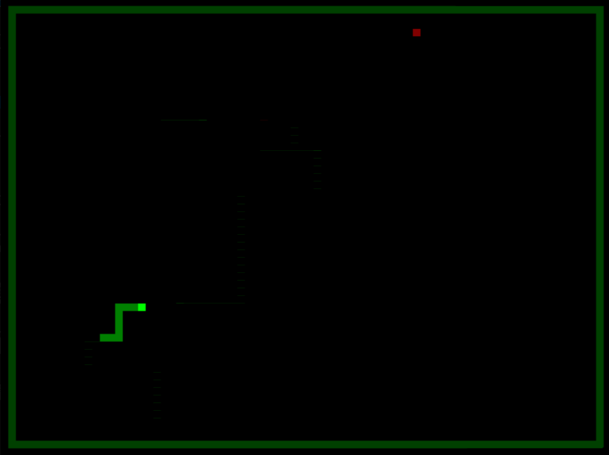
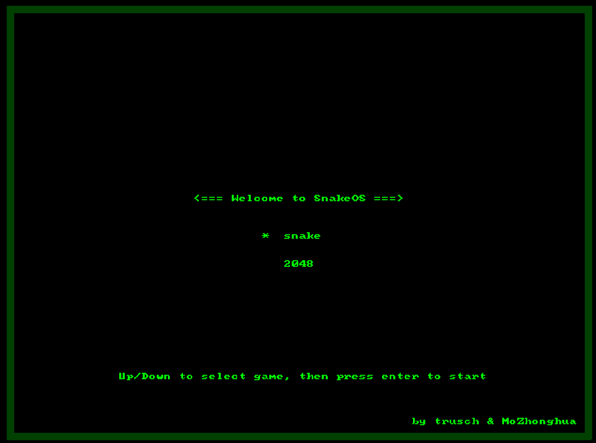
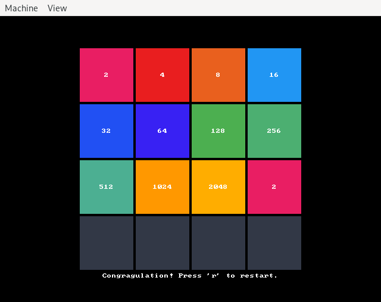

# SnakeOS

This is the game snake, bootable on a x86_64 CPU, written completely in rust. Its foundation is following the very interesting [Writing an OS in Rust](https://os.phil-opp.com/) blog which I would recommend everybody who is interested in this kind of stuff.

## Modify from https://github.com/Rafaelmdcarneiro/snakeos-rs
Modified the environment to run on Windows




## Features

* Play snake or 2048 on any x86_64 CPU
    * Let's have fun!
* Dynamic memory management
    * The snake can grow!
* Interrupt handling
    * We can read the keyboard!
* Async/Await support
    * We can update the world and read user input at the same time!
* Only 226kB kernel size
    * You can even put this on a 8-inch floppy disk!
* All the infrastructure you need to implement and play a game
    * You can implement your own game!

## Screenshots





## How to run it
You need wsl and qemu
```
rustup override set nightly
rustup toolchain install nightly
rustup target add x86_64-unknown-none
rustup component add llvm-tools-preview
cargo run --release
```

